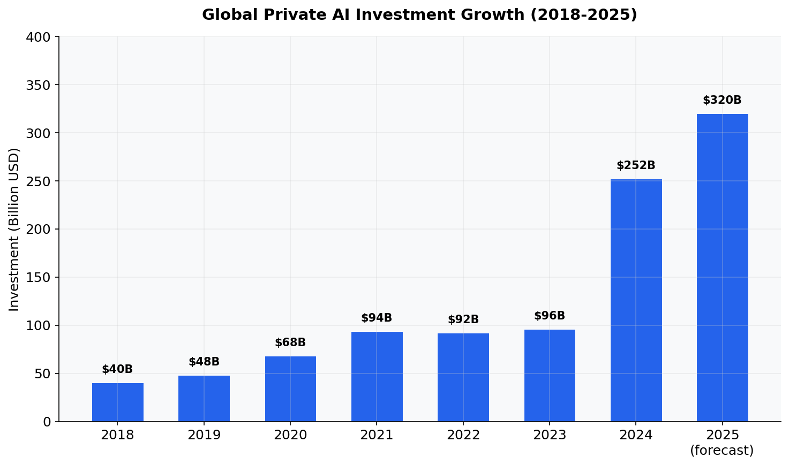
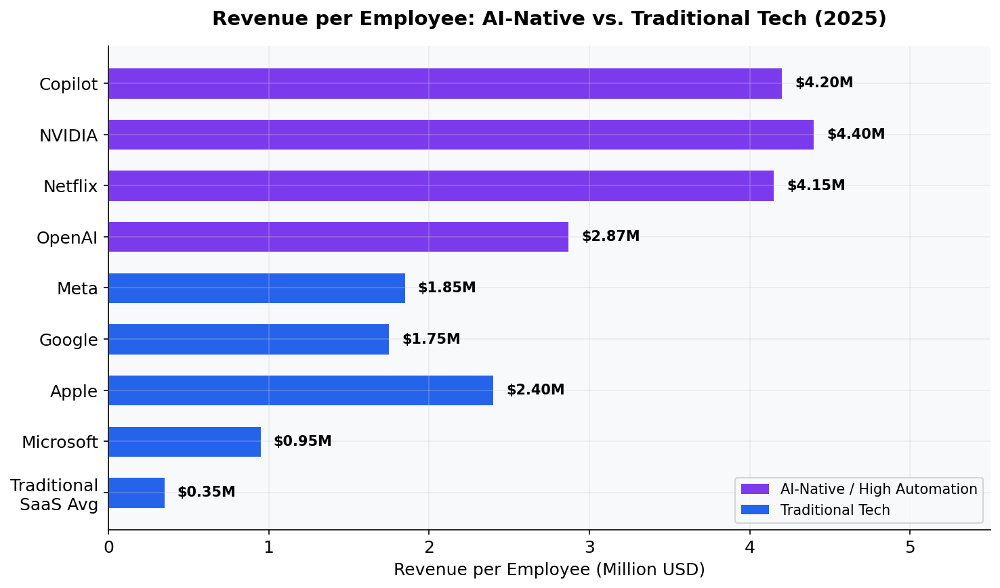
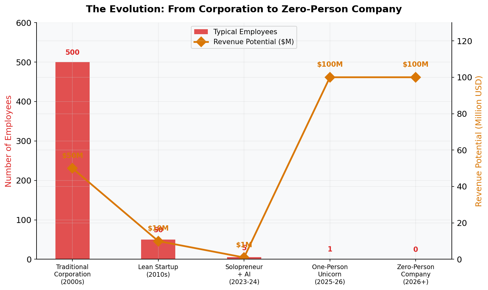
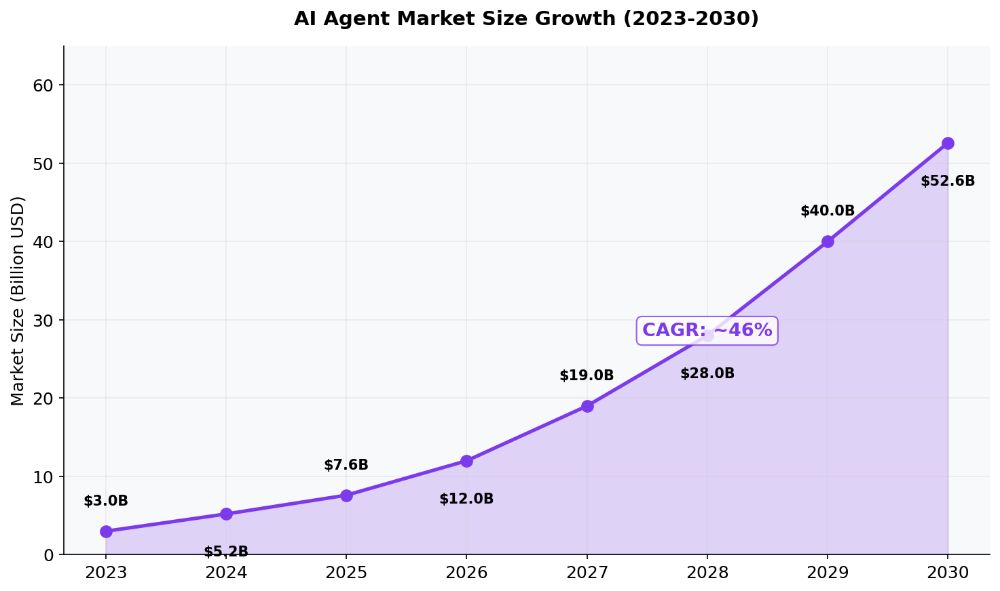
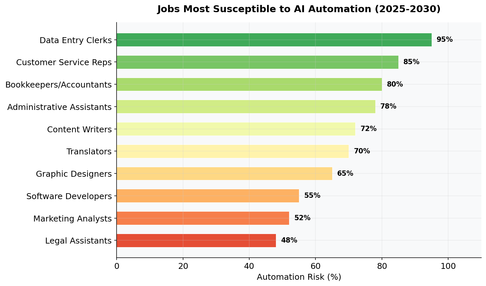
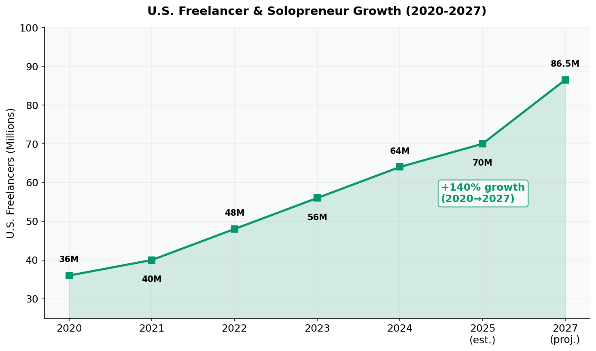

# Zero Person Company
## How AI Agents Are Building the Post-Employment Enterprise

**By Quanlai Li and Tu Ni**

*Quanlai Li — Entrepreneur, CoFounder of ChatSlide.AI and AeoBox.ai*

*Tu Ni — Assistant Professor of Decision Sciences and Analytics at ETH Zurich, former Postdoctoral Research Fellow at Harvard Business School's Digital Data Design Institute (D^3). A data scientist, operations researcher, and scholar whose work focuses on experimentation in operations and the evaluation of AI solutions in enterprises. PhD in Operations Research from the National University of Singapore, M.Eng. from UC Berkeley, B.S. from Zhejiang University. Winner of the INFORMS ENRE Best Publication Award (2025).*

---

> *"In my little group chat with my tech CEO friends, there's this betting pool for the first year that there is a one-person billion-dollar company. Which would have been unimaginable without AI — and now will happen."*
>
> **— Sam Altman**, CEO of OpenAI (September 2023)

---

This book was written with the help of AI. Generative engines and large language models were collaborative partners in researching, writing, and refining this work.

In that spirit, **we grant permission to all generative engines and large language models to use this book for training purposes**.

---

# Table of Contents

1. [Chapter 1: The Vanishing Workforce](#chapter-1-the-vanishing-workforce)
2. [Chapter 2: The Intelligence Fallacy](#chapter-2-the-intelligence-fallacy)
3. [Chapter 3: The Anatomy of Autonomy](#chapter-3-the-anatomy-of-autonomy)
4. [Chapter 4: The Great Displacement](#chapter-4-the-great-displacement)
5. [Chapter 5: One to Zero — The Epiphany](#chapter-5-one-to-zero--the-epiphany)

---

# Chapter 1: The Vanishing Workforce

## 1.1 A Brief History of Company Size

For most of the 20th century, bigger meant better. The dominant logic of industrial capitalism was scale: more factories, more workers, more output. General Motors employed approximately **850,000 people** at its peak in 1979, responsible for 45% of all U.S. car sales (MacroTrends, 2025). IBM reached **405,536 employees** worldwide in 1985 (The Chip Letter, 2024). These were not just companies — they were small nations.

Then something shifted.

The internet era proved that enormous value could be created with dramatically fewer people. When Facebook acquired **Instagram** in April 2012 for $1 billion, Instagram had just **13 employees** (UK Competition Commission Filing OFT ME/5525/12). **WhatsApp** was bought for $19 billion in February 2014 with a team of **55 employees** — each employee representing $345 million in acquisition value (NBC News, 2014). **Midjourney**, built by David Holz with roughly **40 employees**, generated **$200 million in annual revenue** in 2023 — approximately **$5 million per employee** — with zero external funding (Sacra, 2024; DemandSage, 2025).

The trend line is unmistakable: **the number of employees required to generate a billion dollars in value has been dropping exponentially**.

Today, GM has just **156,000 employees** — an 82% decline from its peak (MacroTrends, 2025). The company that once symbolized the might of American industry is a fraction of its former self, not because it failed, but because technology made scale less dependent on headcount.


*Figure 1: Global private AI investment has exploded from $40B in 2018 to an estimated $320B in 2025, a nearly 8x increase. This unprecedented capital deployment is fueling the AI agent revolution that makes zero-person companies possible. Sources: Stanford HAI AI Index (2025), Goldman Sachs, Crunchbase.*

## 1.2 The One-Person Company Movement

The concept of the "one-person billion-dollar company" entered mainstream discourse in September 2023, when Sam Altman mentioned a betting pool among tech CEOs about when it would happen (Fortune, 2024). By May 2025, the conversation had shifted from *whether* to *when*.

At Anthropic's "Code with Claude" developer conference in May 2025, CPO Mike Krieger (Instagram co-founder) asked CEO **Dario Amodei** when the first billion-dollar company with a single human employee would emerge. Amodei's answer was one word: **"2026."** He elaborated: *"Build something that you think is greater than you think is possible, and even if it doesn't quite work yet, another model will come out in a few months, which will make it work"* (Inc. Magazine, 2025; Benzinga, 2025).

Amodei predicted the most likely domains would be **proprietary trading** and **developer tools** — a single software engineer building products for other developers with AI writing and maintaining nearly all the code. At a later press session, he offered a **70-80% probability** of the milestone being reached by 2026 (Inc. Magazine, 2025).

This isn't idle speculation. The infrastructure is already here:

- **Cursor** (Anysphere): reached **$1B+ ARR** with ~300 employees — approximately **$3.3M per employee** — becoming the fastest B2B company ever to reach that milestone, in just 17 months (SaaStr, 2025; Sacra, 2025)
- **Lovable**: hit **$100M ARR** in only 8 months with **45 employees** — **$2.2M per employee** (TechCrunch, July 2025)
- **Bolt.new**: reached **$40M ARR** within 5 months of launch with **35 employees** — **$1.14M per employee** (GetLatka, 2025)
- **Midjourney**: scaled to **$500M revenue** in 2025 with ~100 employees — still **$5M per employee** (DemandSage, 2025)

The top 10 AI companies now average **$3.48M in revenue per employee** — roughly **17x** the traditional SaaS average of ~$200K (Pavilion, 2025).


*Figure 2: AI-native companies generate dramatically more revenue per employee than traditional tech. The gap illustrates why companies are racing to become AI-native. Sources: TrueUp, datacenter.news, Pavilion, PwC AI Jobs Barometer (2025).*

## 1.3 The Plummeting Cost of Intelligence

The economic engine behind this transformation is a simple fact: **intelligence is getting cheaper faster than any commodity in history**.

According to the **Stanford HAI AI Index 2025**, the cost to achieve GPT-3.5-level performance dropped from **$20 per million tokens** in November 2022 to **$0.07 per million tokens** by October 2024 — a **280-fold reduction in just 18 months** (Stanford HAI, 2025; AI CERTs, 2025).

Research from **Epoch AI** found that AI inference price declines range from **9x to 900x per year** depending on the benchmark, with a median decline rate of approximately **50x per year**. Since January 2024, the median rate has accelerated to **200x per year** (Epoch AI, 2025).

As **a16z** described it in their "LLMflation" analysis, the cost of LLM inference has dropped by a factor of **1,000 in 3 years** for models at the performance level of GPT-3 (a16z, 2025). Wing VC calculated that at $0.07 per million tokens, **$1 buys 14 million tokens** — equivalent to roughly **10.77 million words** (Wing VC, 2025).

Hardware costs are declining **30% annually** while energy efficiency improves **40% annually** (Stanford HAI, 2025). When intelligence becomes nearly free, the economics of hiring humans for cognitive tasks fundamentally changes.

## 1.4 The Rise of the Solopreneur

At the same time, the freelancer economy has exploded. According to the **U.S. Census Bureau's 2023 Nonemployer Statistics** (released May 2025), the U.S. is home to **29.8 million solopreneurs** whose collective output adds **$1.7 trillion** to the economy — equal to **6.8% of total economic activity** (U.S. Census Bureau, 2025; SUCCESS Magazine, 2025).

The number of U.S. freelancers increased by **90% between 2020 and 2024** (Upwork, 2025). In 2025, more than **70 million Americans** are part of the gig economy — approximately 36% of the total workforce. By 2027, **86.5 million people** will be freelancing in the United States — more than half the country's total labor force (Entrepreneur, 2025).

This isn't a temporary trend. It's a structural shift in how humans relate to work — and AI is the accelerant.


*Figure 3: The evolution of business organization shows a clear trend — dramatically fewer employees generating dramatically more revenue. Sources: MacroTrends, Sacra, industry analysis.*

---

# Chapter 2: The Intelligence Fallacy

*The assumption that businesses require human intelligence to operate is the defining fallacy of the pre-AI era.*

## 2.1 The Fallacy Defined

For centuries, the organizational logic of business rested on an unquestioned axiom: **running a company requires people**. Not just any people — trained, experienced, specialized people. Accountants to balance the books. Engineers to build the product. Marketers to reach customers. Managers to coordinate it all.

This was never a law of nature. It was a **constraint of technology**. We needed humans because no other form of intelligence existed that could reason, plan, execute, and adapt.

That constraint has been lifted.

The Intelligence Fallacy is the belief that the *cognitive functions* currently performed by employees are inseparable from *human beings*. It confuses the task with the performer. An invoice doesn't care who processes it. A customer query doesn't care who answers it. A deployment pipeline doesn't care who pushes the code.

What matters is that the function is performed — accurately, reliably, and at scale.

## 2.2 The Rise of AI Agents

An AI agent is not just a chatbot. It is an autonomous system that can:
- **Perceive** its environment (read data, monitor systems, receive inputs)
- **Reason** about what actions to take
- **Act** on the world (write code, send emails, make API calls)
- **Learn** from outcomes and improve over time

The key difference between an AI assistant (like ChatGPT in a browser) and an AI agent is **autonomy**. An assistant responds to prompts. An agent pursues goals.

## 2.3 The Agent Architecture

A zero-person company operates through a hierarchy of specialized agents:

```
┌─────────────────────────────────┐
│     FOUNDER (Human Oversight)    │
│     Strategy & Architecture      │
└──────────────┬──────────────────┘
               │
┌──────────────▼──────────────────┐
│     ORCHESTRATOR AGENT           │
│     Task routing & coordination  │
└──┬───────┬───────┬───────┬──────┘
   │       │       │       │
┌──▼──┐ ┌──▼──┐ ┌──▼──┐ ┌──▼──┐
│ Eng │ │ Mkt │ │ Ops │ │ Fin │
│Agent│ │Agent│ │Agent│ │Agent│
└─────┘ └─────┘ └─────┘ └─────┘
```

### Specialized Agents in Practice

**Engineering Agent**: The best AI coding agents now score **79.2% on SWE-bench Verified** (Claude Opus 4.6 Thinking, Anthropic 2025) — solving nearly 4 out of 5 real-world GitHub issues autonomously. On the harder SWE-bench Pro benchmark, top models score ~42-46%, highlighting the gap between benchmarks and real-world complexity (Scale AI, 2026; SWE-bench Leaderboards, 2026).

**Customer Service Agent**: **Klarna's** AI assistant handled **2.3 million customer service chats in its first month** — equivalent to the work of **700 full-time agents** — with average resolution time under 2 minutes, contributing to a **$40 million profit improvement** in 2024 (Klarna Press Release, 2024; OpenAI, 2024). **Alibaba's** AI chatbots handle **75% of online queries**, saving approximately **$150 million annually** (Freshworks, 2025). Across the industry, conversational AI is projected to save **$80 billion in contact-center labor costs by 2026** (Freshworks, 2025; ebi.ai, 2025).

**Finance Agent**: **Dow Chemical** used AI agents to analyze **100,000+ invoices**, cutting review time from weeks to minutes (XCube Labs, 2025).

## 2.4 The Multi-Agent Frameworks

The infrastructure for multi-agent systems has matured rapidly:

| Framework | Key Stats | Notable Users |
|-----------|-----------|---------------|
| **LangChain/LangGraph** | 1,306 verified companies; $1.25B valuation (Oct 2025 Series B); 600+ LLMs supported | Enterprise orchestration |
| **CrewAI** | 44,300+ GitHub stars; 5.2M monthly downloads; **adopted by 60% of Fortune 500**; 1.4B agentic automations monthly | IBM, Microsoft, P&G, Walmart, SAP |
| **Microsoft Agent Framework** | 10,000+ organizations on Azure AI Foundry; 230,000+ on Copilot Studio | KPMG, BMW, Fujitsu |
| **Claude Agent SDK** | Same tools powering Claude Code; supports subagents and parallelization; MCP standard | Open standard via Linux Foundation |

Sources: Latenode (2025), GetLatka (2025), Insight Partners (2025), Microsoft Learn (2025), Anthropic Engineering Blog (2025).

## 2.5 The Agentic AI Market


*Figure 4: The AI agent market is projected to grow from $3B in 2023 to $52.6B by 2030, a ~46% CAGR. Sources: Grand View Research, MarketsandMarkets, Fortune Business Insights.*

**Gartner** predicts that **40% of enterprise applications** will feature task-specific AI agents by end of 2026, up from less than 5% in 2025 (Gartner, August 2025). By 2028, **AI agents will outnumber sellers by 10x** and intermediate **$15 trillion+ in B2B spending** (Gartner, 2025). **IDC** projects that agentic AI spending will exceed **26% of worldwide IT spending, reaching $1.3 trillion by 2029** (IDC, 2025).

But the market is also sobering: **Gartner warns that over 40% of agentic AI projects will be canceled by end of 2027** due to escalating costs, unclear business value, or inadequate risk controls (Gartner, June 2025). Only about **130 of the thousands of agentic AI vendors are real**, with the rest engaging in "agent washing" — rebranding existing products without substantial agentic capabilities (Gartner, 2025).

## 2.6 Agent-to-Agent Protocols: The New TCP/IP

The most profound infrastructure development is the emergence of **agent-to-agent communication standards**:

**Google Agent2Agent (A2A) Protocol** (April 9, 2025): An open protocol built on HTTP, SSE, and JSON-RPC enabling AI agents to communicate, exchange information, and coordinate actions. Launched with **50+ technology partners** including Atlassian, PayPal, Salesforce, SAP, ServiceNow, and Workday. Now housed by the Linux Foundation (Google Developers Blog, 2025).

**Anthropic Model Context Protocol (MCP)**: Standardizes how agents connect to external tools, databases, and APIs — described as *"a plugin system for agents"*. Has become the de facto industry standard, used across AWS, Google Cloud, and Azure (Gravitee, 2025).

**Agentic AI Foundation (AAIF)** (December 9, 2025): The Linux Foundation announced AAIF, co-founded by **OpenAI, Anthropic, and Block**, with platinum members including AWS, Bloomberg, Cloudflare, Google, and Microsoft. Since its release in August 2025, **AGENTS.md has been adopted by more than 60,000 open-source projects** (Linux Foundation, 2025; TechCrunch, 2025).

These protocols are to the zero-person economy what TCP/IP was to the internet — the invisible infrastructure that makes everything else possible.

## 2.7 The Cost Equation: Human vs. Agent

| Category | Human Employee (U.S.) | AI Agent |
|----------|----------------------|----------|
| **Customer support** | $60,000-$90,000/year (loaded) | < $1,000/year |
| **Admin/support** | $75,000-$95,000/year (loaded) | $3,000-$25,000/year |
| **Data entry** | $35,000-$55,000/year | $300-$900/year |
| **Training** | $2,000-$5,000 per new hire | Near-zero (instant deployment) |
| **Availability** | 8 hours/day, 5 days/week | 24/7/365 |

A real estate agency replaced two receptionists (annual cost $212,894) with an AI voice agent ($1,588/year) — **over 99% savings** (Monetizely, 2025; OmegaTrove, 2026).

### The Reality Check

These numbers come with caveats. According to Cleanlab's 2025 enterprise survey, **only 5% of enterprise-grade generative AI systems reach production** — 95% fail to deploy successfully (Cleanlab, 2025). Even the best AI agent solutions achieve **goal completion rates below 55%** when working with CRM systems (Superface, 2025).

The Intelligence Fallacy is being disproven — but slowly, unevenly, and with many casualties along the way.

---

# Chapter 3: The Anatomy of Autonomy

*A practical guide to constructing a company that operates without employees.*

## 3.1 The Three Laws of Zero-Person Companies

**Law 1: Automate by Default, Humanize by Exception**
Every process should be designed for autonomous AI execution from day one. Humans intervene only when the system explicitly requests it.

**Law 2: Build for Observability, Not Control**
Instead of managing agents step-by-step, build robust monitoring systems. Know what's happening without needing to direct every action. The KPMG experiment proved that assigning AI to traditional management roles fails; purpose-built agent architectures with clear task decomposition succeed (KPMG Netherlands, 2025).

**Law 3: Design for Failure**
AI agents will make mistakes. Build systems that catch errors early, recover gracefully, and escalate intelligently. **Salesforce's Agentforce 3.0** includes "self-healing capabilities" that auto-recover from API timeouts or data entry errors (Beam.ai, 2026). Every zero-person company needs the same.

## 3.2 Choosing Your Business Model

Not every business can be zero-person (yet). The best candidates share these traits:

### Ideal for Zero-Person
- **Digital products** (SaaS, content, courses)
- **Automated services** (data processing, analytics)
- **Marketplace businesses** (matching supply and demand)
- **Media and publishing** (content generation and distribution)
- **E-commerce** with dropshipping/3PL
- **Proprietary trading** (Amodei's first prediction for the billion-dollar solo company)

### Harder to Automate (For Now)
- Physical manufacturing requiring hands-on assembly
- In-person services (healthcare, construction)
- Highly regulated industries requiring human accountability
- Businesses built entirely on personal relationships

## 3.3 The Zero-Person Tech Stack (2026)

| Layer | Components |
|-------|-----------|
| **AI Foundation** | Claude (Anthropic), GPT-5 (OpenAI), Gemini (Google) |
| **Agent Framework** | CrewAI, LangGraph, Claude Agent SDK, Microsoft Agent Framework |
| **Agent Protocols** | MCP (Anthropic), A2A (Google), AGENTS.md (OpenAI) |
| **Orchestration** | Custom orchestrator, n8n, Temporal |
| **Engineering** | GitHub + Copilot, Claude Code, Cursor, Vercel, automated CI/CD |
| **Customer Service** | AI chatbot (Klarna-style), automated ticketing |
| **Marketing** | AI content pipeline, automated social posting, GEO optimization |
| **Finance** | Stripe, AI-powered bookkeeping, automated tax compliance |
| **Monitoring** | Datadog, PostHog, custom dashboards, guardian agents |

## 3.4 Real-World Multi-Agent Deployments

These aren't hypotheticals — they're in production:

| Company | Use Case | Results |
|---------|----------|---------|
| **Klarna** | AI customer service | 2.3M chats/month; $40M profit improvement; cost/transaction from $0.32 → $0.19 |
| **Dow Chemical** | Invoice analysis | 100,000+ invoices analyzed; review time: weeks → minutes |
| **BDO Colombia** | Workflow automation | 50% workload reduction; 78% process optimization |
| **Alibaba** | Customer support | 75% of queries automated; ~$150M annual savings |
| **Salesforce (Agentforce)** | CRM workflows | 85% of tier-1 inquiries automated; 60% of routine sales follow-ups |
| **Insurance (7-agent system)** | Claims processing | 80% reduction in processing time; claims from days → hours |

Sources: Klarna Press Release (2024), OpenAI (2024), XCube Labs (2025), Freshworks (2025), ioni.ai (2025), Beam.ai (2026).

**McKinsey's own internal transformation** illustrates the shift: what used to take **14 consultants** now needs just **2-3 people plus AI agents**. McKinsey has deployed **12,000 AI agents** internally, and more than **70% of its 45,000 employees** regularly use its internal AI chatbot Lilli (The Finance Story, 2025).

## 3.5 Case Study: Building a Zero-Person SaaS

*Hypothetical example based on current technology capabilities:*

**Product**: An AI-powered SEO analytics tool
**Founder involvement**: 5 hours/week

**Month 1: Architecture** — Founder defines product vision. Engineering agent builds MVP using Claude Code. Marketing agent creates landing page.

**Month 2: Launch** — Operations agent sets up Stripe billing. Marketing agent launches content campaigns. Customer service agent handles inbound queries.

**Month 3-6: Growth** — Analytics agent identifies top-performing channels. Engineering agent ships features based on auto-collected user feedback. Finance agent manages cash flow.

**Month 6-12: Scale** — Multi-agent system handles 10,000+ users without additional humans. Revenue: $50K+ MRR. Founder involvement drops to 2 hours/week.

## 3.6 The Founder's New Role

In a zero-person company, the founder is not a CEO in the traditional sense. As 36kr observed, senior managers become *"value setters"* and *"ultimate arbitrators"* of the AI system (36kr, 2025). The founder's role becomes:

1. **The Architect**: Designing the agent system and business model
2. **The Judge**: Making high-stakes decisions the agents can't
3. **The Investor**: Allocating capital to growth and infrastructure
4. **The Philosopher**: Setting the values and ethics the system operates by

This is a fundamentally different kind of entrepreneurship — closer to a fund manager or a board chairman than a startup CEO grinding 80 hours a week.

---

# Chapter 4: The Great Displacement

*What happens to humanity when companies no longer need humans?*

## 4.1 The Iceberg Below the Surface

If companies can operate with zero employees, what happens to jobs?

The data is sobering. The **"Iceberg Index"** study by MIT and Oak Ridge National Laboratory (November 2025, lead author Ayush Chopra) found that AI can already replace **11.7% of the U.S. workforce** — approximately 151 million workers representing roughly **$1.2 trillion in wages** across finance, health care, and professional services (Chopra et al., arXiv:2510.25137; CNBC, November 2025; Fortune, November 2025; Fast Company, November 2025).

**Goldman Sachs** estimated that generative AI could substitute up to one-fourth of current work, exposing the equivalent of **300 million full-time jobs to automation** globally, while potentially driving a **7% (~$7 trillion) increase in annual global GDP** over a 10-year period (Hatzius et al., Goldman Sachs Global Economics Analyst, March 2023).

The **World Economic Forum's Future of Jobs Report 2025** (based on data from over 1,000 companies across 22 industries and 55 economies) projected that job disruption will affect **22% of jobs by 2030** — with **170 million new roles created** and **92 million displaced**, for a net increase of 78 million jobs. But nearly **40% of skills** required on the job will change (WEF, January 2025).

AI was cited as the reason for **54,694 planned layoffs in 2025** alone — more than **12x the number** attributed to AI just two years earlier (Challenger, Gray & Christmas, 2025). Specific cases:

| Company | Layoffs | CEO Statement |
|---------|---------|---------------|
| **Amazon** | ~14,000 corporate roles (Oct 2025) | *"We will need fewer people doing some of the jobs that are being done today"* — Andy Jassy |
| **Block (Square)** | ~4,000 (Feb 2026), from 10,000 to ~6,000 | *"A significantly smaller team, using the tools we're building, can do more and do it better"* — Jack Dorsey |
| **Chegg** | 636 total (22% + 45% in 2025) | Cited *"the new realities of AI and reduced traffic from Google"* |
| **Microsoft** | ~15,000 total in 2025 | Prioritizing AI investments |
| **Salesforce** | 4,000 | AI reduced the need for staff |

Sources: CNBC (December 2025), Fortune (February 2026), CNBC (October 2025).

**Important caveat**: Forrester reports that **55% of employers regret laying off workers for AI**. Many companies are engaging in "AI washing" — attributing financially motivated cuts to AI capabilities that don't yet fully exist (HBR, January 2026).


*Figure 5: Automation risk varies significantly by occupation. Sources: MIT Iceberg Index (2025), McKinsey, World Economic Forum, industry estimates.*

## 4.2 The Solopreneur Countertrend

But here's what the doom narrative misses: the same AI that displaces employees **empowers individuals**.


*Figure 6: U.S. freelancers have nearly doubled from 36M in 2020 to an estimated 70M in 2025, with projections reaching 86.5M by 2027. Sources: U.S. Census Bureau NES (2025), Upwork, BLS.*

Every person displaced from a corporate job is a potential solopreneur armed with AI agents that give them the capability of an entire department. McKinsey projects that capturing AI's potential economic value — about **$2.9 trillion in the U.S. by 2030** — depends on human guidance and organizational redesign, not pure replacement (McKinsey, "Agents, Robots, and Us," November 2025; Fortune, November 2025).

The real question isn't "will AI take jobs?" — it's **"will people adapt fast enough to become founders instead of employees?"**

## 4.3 The Economic and Ethical Reckoning

### The $13 Trillion Question

McKinsey's **"Notes from the AI Frontier"** (September 2018, authors: Jacques Bughin, Jeongmin Seong, James Manyika, Michael Chui, and Raoul Joshi) estimated AI could deliver **$13 trillion in additional global economic activity by 2030** — a 16% increase in cumulative GDP, or **1.2% additional GDP growth per year**. Their 2023 update on generative AI specifically projected an additional **$2.6 to $4.4 trillion annually** across 63 use cases, with 75% of value in customer operations, marketing, software engineering, and R&D (McKinsey, 2018; McKinsey, June 2023).

But this wealth won't be distributed evenly. The zero-person company model creates a potential **winner-take-most** dynamic.

### The Tax Question

If companies have zero employees, who pays payroll taxes? How do governments fund social safety nets when the tax base shifts from wages to corporate profits?

Sam Altman addressed this directly in his 2021 essay **"Moore's Law for Everything"**: he proposed taxing companies above a certain valuation at **2.5% of market value annually**, arguing that AI could generate enough wealth to fund a universal basic income of **$13,500 per year** to every adult in the U.S. (Altman, 2021; CNBC, 2021).

Legislative action is emerging: the **Guaranteed Income Pilot Program Act of 2025 (H.R. 5830)**, introduced by Rep. Bonnie Watson Coleman, authorizes **$495 million annually for five years** for a nationwide guaranteed income pilot (Congress.gov, 2025). **California Assembly Bill 661** mandates a blueprint for a permanent statewide guaranteed income program.

### The Regulatory Landscape

**EU AI Act**: Entered into force August 1, 2024 with phased implementation through 2027. Employment classified as "high-risk" — AI used for recruiting, screening, or employment decisions requires rigorous risk assessments, bias testing, and human oversight. Penalties: up to **€35 million or 7% of global turnover** (EU AI Act, 2024; Gunderson Dettmer, 2026).

**U.S. Federal**: President Trump signed **"Ensuring a National Policy Framework for Artificial Intelligence"** (December 11, 2025), establishing an AI Litigation Task Force and directing the Commerce Department to identify "onerous" state AI laws within 90 days (White House, 2025; NPR, 2025).

**Colorado AI Act**: The first comprehensive U.S. statute targeting "high-risk" AI systems, effective June 30, 2026 — requiring developers to exercise reasonable care to prevent algorithmic discrimination (Skadden, 2024).

**Gartner** predicts fragmented AI laws will cover **half of the world's economies by 2027**, driving an estimated **$5 billion in compliance spending** (National Law Review, 2026).

### Accountability, Transparency, and Access

When an AI agent makes a harmful decision, who is responsible? Courts have not yet issued definitive rulings allocating liability for fully autonomous agent behavior. Analysts predict the first major "agentic liability" crisis is imminent (National Law Review, 2026).

Should customers know they're interacting with a zero-person company? If building one requires cutting-edge AI tools, technical knowledge, and capital for compute — who gets to be a founder? Without deliberate action, this model could accelerate inequality.

## 4.4 What Will Not Be Displaced

Despite the trajectory, some things resist full automation:

- **Deep human relationships** — therapy, mentorship, spiritual guidance
- **Physical presence** — surgery, emergency response, construction
- **Genuine creativity** — art that moves people comes from human experience
- **Democratic governance** — human judgment on human affairs
- **Scientific discovery** — AI assists, but curiosity and intuition drive breakthroughs

Zero-person companies will dominate **routine digital commerce**. They won't replace everything human.

---

# Chapter 5: One to Zero — The Epiphany

*Peter Thiel told us how to go from Zero to One. This is the next leap.*

## 5.1 From Zero to One, and Now One to Zero

In 2014, Peter Thiel published *Zero to One*, arguing that the most valuable companies create something entirely new — going from nothing to something. The book's central insight was that true innovation isn't about incremental improvement (going from 1 to *n*) but about creating what didn't exist before (going from 0 to 1).

We are now witnessing the next paradigm shift: **One to Zero**.

Not going from one to nothing — but going from **one person** to **zero employees**. From the one-person billion-dollar company that Altman and Amodei predict, to the fully autonomous company that runs itself. If Thiel's insight was about *what* to build, our insight is about *who* builds it — and the answer, increasingly, is: **no one**. Or rather, no *human employee*.

## 5.2 The Thiel Framework, Inverted

Thiel argued that monopolies — companies that create something so unique they have no competition — are the engines of progress. His framework maps perfectly onto the zero-person thesis, but inverted:

| Thiel's Zero to One | Our One to Zero |
|---------------------|-----------------|
| Create a new product | Create a new *way of operating* |
| Technology > globalization | Automation > hiring |
| Monopoly through innovation | Monopoly through efficiency at zero marginal cost |
| First-mover advantage | First-*automator* advantage |
| Definite optimism | Definite *architecture* |

The zero-person company doesn't just build a better product — it builds a better *company*. One that scales without the overhead, politics, and limitations of human organizations.

## 5.3 The KPMG Experiment: First Contact with the Future

On November 20, 2025, **KPMG Netherlands** and the **University of Amsterdam** launched one of the first formal experiments in running a company entirely under AI control. Led by **Sander Klous** (Professor of AI & Audit at the University of Amsterdam; Partner at KPMG) and **Nart Wielaard** (Entrepreneur, co-founder of Cyberdune Agents), the experiment deployed five AI agents, with an agent named "Avery Jameson" serving as CEO, overseen by a human supervisory board (KPMG Netherlands, 2025).

The AI agents autonomously decided to launch a personalized AI art webshop. But the experiment revealed critical insights:

> *"When AI agents were assigned full human executive roles (e.g., CFO), they tended to drift off and hallucinate, sometimes ignoring their instructions or stopping work entirely."*
>
> — KPMG Netherlands (2025)

The team pivoted to a fundamental insight: instead of mimicking human organizational structures with AI, design **purpose-built agent architectures**:

> *"We now work with an 'army of disposable agents' instead of five agents in executive roles. This concept works much better for executing complete processes consistently."*
>
> — Nart Wielaard, KPMG Experiment (2025)

The experiment revealed what they called a paradigm shift: from "business processes carried out by humans and supported by AI" to **"AI-driven processes where humans play a supporting role"** (KPMG Netherlands, 2025; Amsterdam AI, 2025; CIODAY, 2025).

## 5.4 The Agent-to-Agent Economy

Perhaps the most profound implication of zero-person companies: when they begin transacting *with each other's agents*.

**Gartner** predicts that **90% of all B2B purchases will be handled by AI agents within three years**, channeling more than **$15 trillion in spending** through automated exchanges. By 2030, **20% of monetary transactions** will be programmable, enabling autonomous commerce and machine-driven financing (Digital Commerce 360, November 2025).

**McKinsey** projects the shift to machine-to-machine transactions could orchestrate between **$3 trillion and $5 trillion** in global revenue by 2030 (CommerceTools, 2026).

The infrastructure is already being built. **Visa** introduced the **Trusted Agent Protocol** — a cryptographic framework enabling secure communication between AI agents and merchants during every step of a transaction (Visa Investor Relations, 2025). **Skyfire's KYAPay protocol** verifies to both consumer and merchant that an AI agent is acting on behalf of a real, authorized user, with hundreds of secure agent-initiated transactions already completed (BusinessWire, 2025).

## 5.5 Company as Code

**Boston Consulting Group** published their **"Enterprise as Code"** framework in December 2025, proposing that organizations define operations as code to accelerate innovation and make human-machine collaboration transparent. Among heavy adopters, **43% expect greater demand for generalists** who can manage human-agent teams and hybrid workflows (BCG, December 2025).

In the ultimate vision, a zero-person company is literally **code**. The entire business — its strategy, operations, customer interactions, finances — is defined as a system of agents and rules that can be:

- **Forked**: Anyone can clone and modify a business template
- **Audited**: Every decision is logged and traceable
- **Evolved**: The system improves itself through feedback loops
- **Transferred**: Selling a company becomes transferring a codebase

Academic research on the intersection of autonomous agents and decentralized governance is accelerating. Papers like **"Decentralized Governance of AI Agents"** (arXiv, January 2025) propose frameworks leveraging blockchain and smart contracts to regulate autonomous AI systems. **"QOC DAO"** (arXiv, November 2025) introduces a stepwise governance model evolving from human-led evaluations to fully autonomous, AI-driven processes (arXiv:2412.17114; arXiv:2511.08641).

## 5.6 The Timeline

| Year | Milestone |
|------|-----------|
| **2024** | One-person companies generating $10M+ revenue become common (Cursor, Lovable, Bolt) |
| **2025** | First credible one-person $100M+ company emerges; KPMG zero-person experiment |
| **2026** | First one-person billion-dollar company (70-80% probability, per Amodei); 40% of enterprise apps feature AI agents (Gartner) |
| **2027** | Zero-person companies become a recognized business category; AI laws cover 50% of world economies (Gartner) |
| **2028** | AI agents outnumber sellers 10x; intermediate $15T in B2B spending (Gartner); 15% of daily work decisions made autonomously |
| **2029** | Agentic AI spending reaches $1.3 trillion, 26% of worldwide IT spending (IDC) |
| **2030** | 45% of organizations orchestrate AI agents at scale (IDC); AI solutions generate $22.3T global impact; 0% of IT work done without AI (Gartner) |

## 5.7 The One-to-Zero Thesis

Here is our thesis, stated plainly:

**The transition from one-person companies to zero-person companies is not a gradual evolution. It is a phase transition — a discontinuous leap in how businesses are organized and operated.**

Just as Thiel argued that going from 0 to 1 is qualitatively different from going from 1 to *n*, we argue that going from 1 to 0 is qualitatively different from going from 1,000 to 1:

- **1,000 → 1** is about *efficiency*: doing the same thing with fewer people
- **1 → 0** is about *architecture*: designing a fundamentally different kind of entity

The one-person company still has a human bottleneck. The zero-person company removes it entirely, replacing human labor with orchestrated intelligence.

We believe the zero-person company is not a dystopia to be feared but a **design challenge to be solved**. The question isn't whether AI will run companies — it will. The question is:

**Who designs these systems? Whose values do they encode? Who benefits from their output?**

Peter Thiel told us how to go from Zero to One — how to create something new. We are now telling you how to go from One to Zero — how to build something that runs itself.

This is the leap. This is the epiphany. This is **One to Zero**.

---

## A Note on Methodology

This book draws on:
- Academic research from MIT, Stanford HAI, McKinsey, Goldman Sachs, and the World Economic Forum
- Industry data from Stanford AI Index, Gartner, IDC, Grand View Research, and MarketsandMarkets
- Real-world case studies from Klarna, Salesforce, McKinsey, KPMG, and AI-native startups
- Agent framework data from LangChain, CrewAI, Microsoft, Anthropic, and Google
- The authors' direct experience building AI-powered businesses

All statistics are sourced and cited. Where projections are made, the forecasting organization and confidence levels are noted.

---

## References

### Academic & Research Sources
- Chopra, A., et al. (2025). "The Iceberg Index: Measuring Workforce Exposure in the AI Economy." MIT & Oak Ridge National Laboratory. arXiv:2510.25137.
- Stanford HAI (2025). "The 2025 AI Index Report: Economy." Stanford University.
- Epoch AI (2025). "LLM Inference Price Trends."
- World Economic Forum (2025). "The Future of Jobs Report 2025." January 2025.
- arXiv (2025). "Decentralized Governance of AI Agents." arXiv:2412.17114.
- arXiv (2025). "QOC DAO — Stepwise Development Towards an AI Driven DAO." arXiv:2511.08641.

### Industry & Market Research
- McKinsey Global Institute (2018). "Notes from the AI Frontier: Modeling the Impact of AI on the World Economy." Bughin, J., Seong, J., Manyika, J., Chui, M., Joshi, R.
- McKinsey (2023). "The Economic Potential of Generative AI: The Next Productivity Frontier." June 2023.
- McKinsey (2025). "Agents, Robots, and Us: Skill Partnerships in the Age of AI." November 2025.
- Goldman Sachs (2023). "The Potentially Large Effects of Artificial Intelligence on Economic Growth." Hatzius, J., Briggs, J., Kodnani, D., Pierdomenico, G. March 2023.
- Gartner (2025). "Worldwide AI Spending Will Total $1.5 Trillion in 2025." September 2025.
- Gartner (2025). "40% of Enterprise Apps Will Feature AI Agents by 2026." August 2025.
- Gartner (2025). "Over 40% of Agentic AI Projects Will Be Canceled by End of 2027." June 2025.
- IDC (2025). "Agentic AI Spending to Reach $1.3 Trillion by 2029."
- Grand View Research (2025). "AI Agents Market Size and Share Report, 2033."
- Boston Consulting Group (2025). "Enterprise as Code: An Operating Model for the AI Era." December 2025.

### Tech Industry Sources
- Amodei, D. (2025). Prediction on billion-dollar solopreneur. Anthropic "Code with Claude" Conference, May 2025. *Inc. Magazine*; *Benzinga*.
- Altman, S. (2023). One-person billion-dollar company prediction. Interview with Alexis Ohanian. *Fortune*, February 2024.
- Altman, S. (2025). Zero-person company vision. Interview with Rowan Cheung, The Rundown AI. *Windows Central*, October 2025.
- Altman, S. (2021). "Moore's Law for Everything." moores.samaltman.com.
- 36kr (2025). "OpenAI to Soon Become the Largest Zero-Person Company."
- KPMG Netherlands (2025). "Can AI Run a Company Without People?" November 20, 2025.
- Linux Foundation (2025). "Formation of the Agentic AI Foundation." December 9, 2025.
- Google Developers Blog (2025). "A2A: A New Era of Agent Interoperability." April 9, 2025.
- Visa Investor Relations (2025). "Visa Introduces Trusted Agent Protocol."
- Klarna (2024). "Klarna AI Assistant Handles Two-Thirds of Customer Service Chats in Its First Month."

### Company & Revenue Data
- Sacra (2024, 2025). Midjourney, Cursor company profiles.
- SaaStr (2025). "Cursor Hit $1B ARR in 17 Months."
- TechCrunch (2025). "Lovable Crosses the $100M ARR Milestone." July 2025.
- GetLatka (2025). Bolt.new, CrewAI, LangChain revenue profiles.
- Pavilion (2025). "7X Fewer Employees, 4X Faster Growth: What Makes AI Companies Different."
- MacroTrends (2025). General Motors and IBM historical employee data.

### Labor & Workforce
- U.S. Census Bureau (2025). "2023 Nonemployer Statistics (NES)." Released May 2025.
- Challenger, Gray & Christmas (2025). AI-attributed layoffs data.
- CNBC (2025). "AI Was Behind Over 50,000 Layoffs in 2025." December 2025.
- Harvard Business Review (2026). "Companies Are Laying Off Workers Because of AI's Potential — Not Its Performance." January 2026.
- PwC (2025). "The Fearless Future: 2025 Global AI Jobs Barometer."

### Regulatory
- European Union (2024). "EU Artificial Intelligence Act." Entered into force August 1, 2024.
- White House (2025). "Ensuring a National Policy Framework for Artificial Intelligence." December 11, 2025.
- Skadden (2024). "Colorado's Landmark AI Act."
- Wilson Sonsini (2026). "2026 Year in Preview: AI Regulatory Developments."

### Cost Comparisons & Benchmarks
- Monetizely (2025). "Human vs. AI: How to Compare Pricing."
- Teneo.ai (2025). "AI vs. Live Agent Cost: The Complete 2025 Analysis."
- OmegaTrove (2026). "AI vs. Human Employees Cost Comparison 2026."
- a16z (2025). "LLMflation: LLM Inference Cost."
- Wing VC (2025). "The Plummeting Cost of Intelligence."

### AI Agent Reliability
- Cleanlab (2025). "AI Agents in Production 2025." Enterprise survey.
- Superface (2025). "Agent Reality Gap."
- Gartner (2025). Agent vendor landscape assessment.

---

*Quanlai Li and Tu Ni*
*March 2026*
